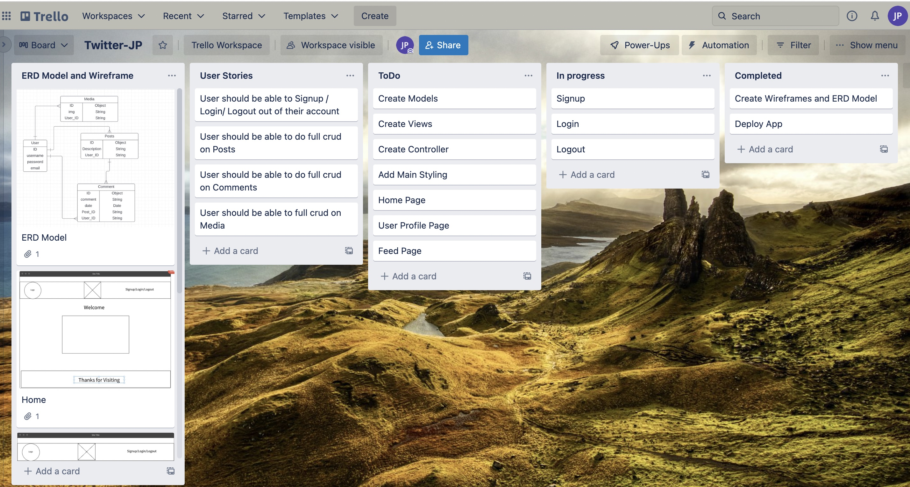
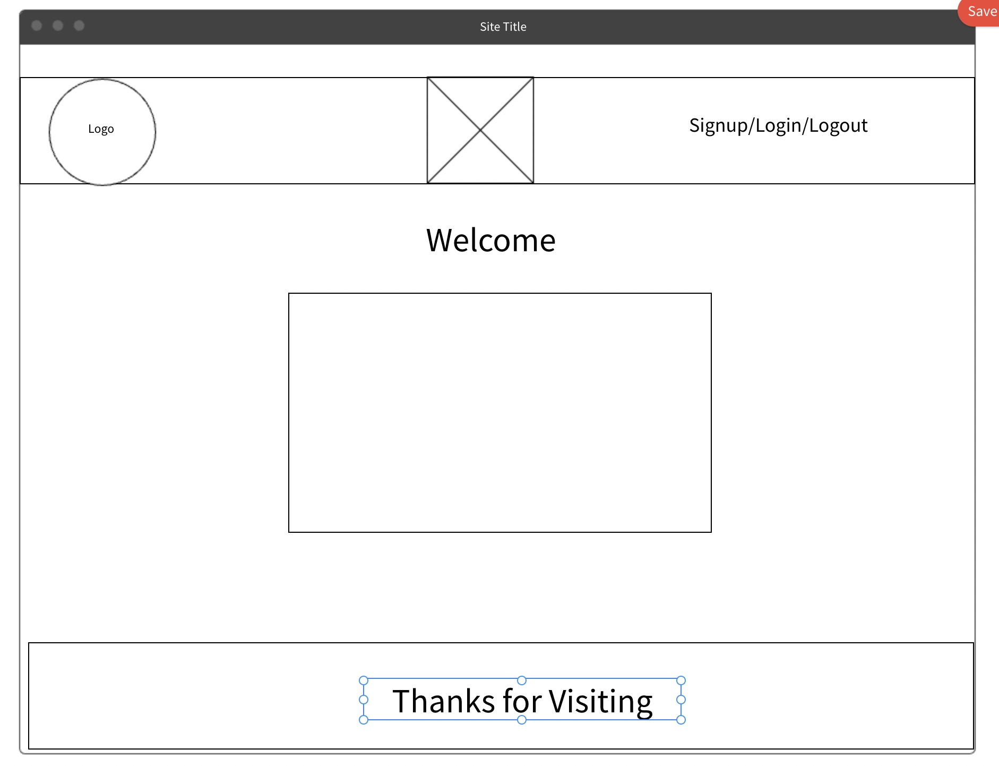
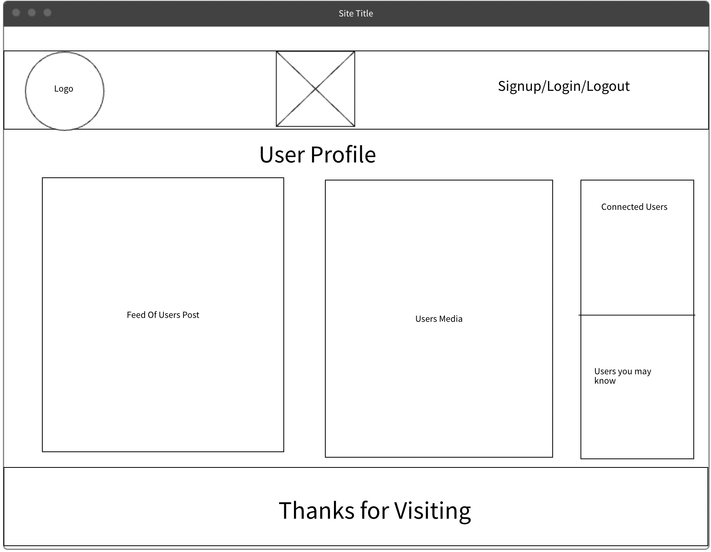
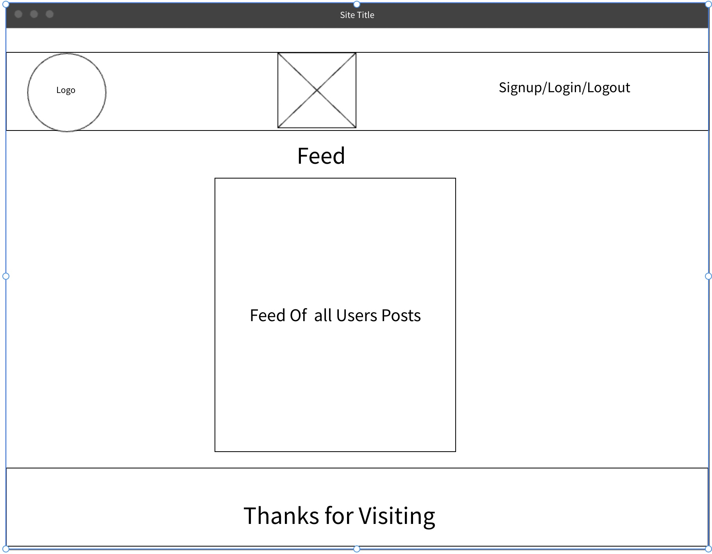

# Twitter-JP

# Product Requirements Documentation

**Summary**

| Field | Detail |
|--------|-----|
| Project Name | Twitter-JP |
| Description | A website where users can interact with our community members. |
| Developers | Jonathan Pierre |
| Live Website (FrontEnd) | https://twitter-jp.netlify.app/ |
| Repo-Frontend | https://github.com/JPierre23/Twitter-JP-frontend |
| Live Website (BackEnd) | https://twitter-jp-backend.herokuapp.com/ |
| Repo-Backend | https://github.com/JPierre23/Twitter-JP |
| Trello Board | https://trello.com/b/Gouvq5rE/twitter-jp |

## Technologies Used
-HTML5
-CSS3
-JavaScript
-Node.js
-Express
-Meterilize

## Problem Being Solved and Target Market
Enables members of a community to be able to interact with each other

## User Stories
- Users should be able to access the site
- As a user I should be able to signup / login to a created account
- As a user I should only be able to Create, Edit, Delete my own posts, and comments.
- As a user I should be able to view different posts created by other users.
- As a user I should be able to leave comments on posts.
- As a user I should be able to easily navigate through the website.

## Screenshots

## Future Enhancements
